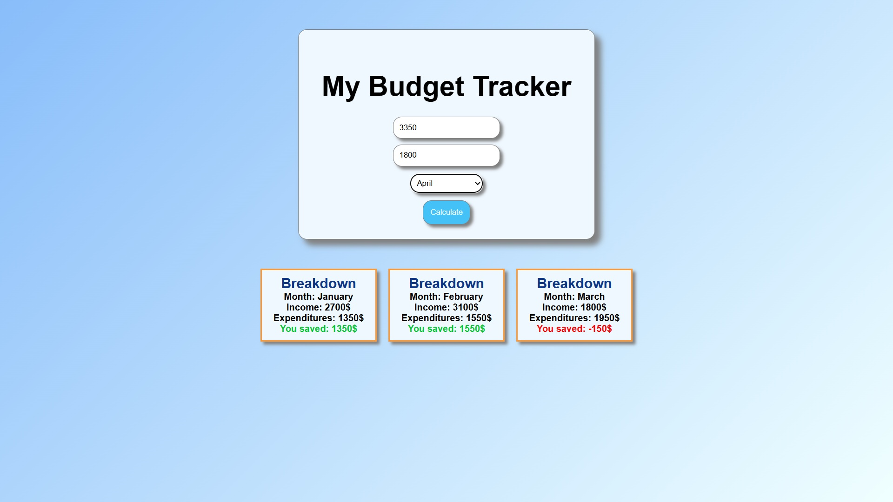

# 💰 Budget Tracker

A simple and interactive budget tracker web app that lets users input their income, expenditures, and month, and see how much they saved. Useful for practicing DOM manipulation, conditionals, and dynamic UI updates with vanilla JavaScript.

---

## ✨ Features

- 📅 Select a month and input your income & expenditures
- 🔢 Calculates and displays the amount saved
- ✅ Positive savings are shown in green
- ❌ Negative or zero savings are shown in red
- 📦 All results appear as separate breakdown blocks
- 🎨 Clean and responsive design using basic HTML/CSS
- ⚡ Built with pure JavaScript (no frameworks)

---

## 🔧 Tech Stack

- HTML5
- CSS3
- JavaScript (Vanilla)

---

## 📸 Screenshots

### ➕ Income and Expense Entry

